# Change Feed with Azure Functions

In this lab, you will create a number of Azure Functions to consume data from the CosmosDB Change feed.

## Prerequisites

In order to successfully complete this lab you will need the latest .NET Core SDK, and a text editor suitable for programming. This lab will use Visual Studio Code, an open source IDE provided by Microsoft.

To get started with the .NET Core SDk, [Follow this Tutorial](https://aka.ms/dotnetcoregs)

To download and use Visual Studio Code, [Click this Link](https://code.visualstudio.com/)

Finally, you will need a Microsoft Azure account. Free accounts are available for demo purposes. [Visit the Azure Portal](https://portal.azure.com) for details.

## Setup

> Before you start this lab you will need to set up and configure a number of Azure resources that you will use throughout the lab. The .NET SDK requires credentials to connect to your Azure accounts. You will collect and store these credentials in this step.

### Create an Azure Resource Group for this Lab

_You will create an azure resource group to allow for easy management of the resources utilized in this lab_

1. In a new browser window, sign in to the **Azure Portal** (<https://portal.azure.com>).

1. On the left side of the portal, click the **Resource Groups** link.

   

1. In the **Resource Groups** blade, select **Add**

   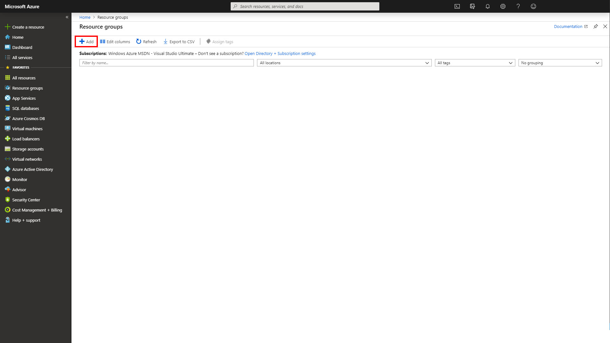

1. In the **Create a resource group** window, create a new resource

   1. Leave Subscription set to the **default** value

   1. Name the resource group **cosmosdblab-group**

   1. Set the Region to one that is closest to your location

   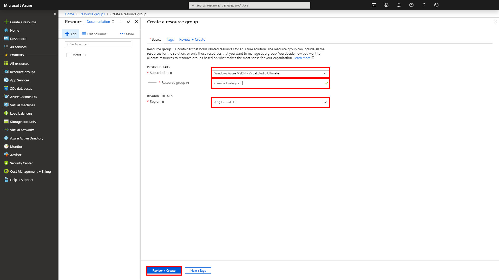

1. At the bottom of the window, click **Review + Create**

1. At the bottom of the review window, click **Create**

> Creation of a new resource group may take a few moments

### Create Azure Cosmos DB Account

_You will now create an Azure Cosmos DB account._

1. On the left side of the portal, click the **Resource groups** link.

   

1. In the **Resource groups** blade, locate and select the **cosmosdblab-group** _Resource Group_.

   

1. In the **cosmosdblab-group** blade, click the **Add** button

   

1. In the **Get Started** blade that opens, type _Azure Cosmos DB_ into the search bar and select the first result.

1. In the new window, click **Create**

   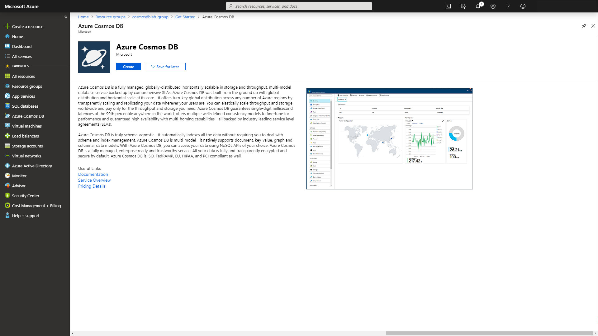

1. In the **Create Azure Cosmos DB Account** window, complete the following configuration.

   1. Leave _Subscription_ set to the **default** value

   1. Choose the **cosmosdblab-group** resource group from _Resource Group_ drop down

   1. In _Account Name_ enter **cosmosdblab** with a numeric suffix like **cosmosdblab0101**.

   1. Leave the _Api_ set to **Core (SQL)**

   1. Set the _Location_ to the region nearest you

1. Click **Review + Create**

   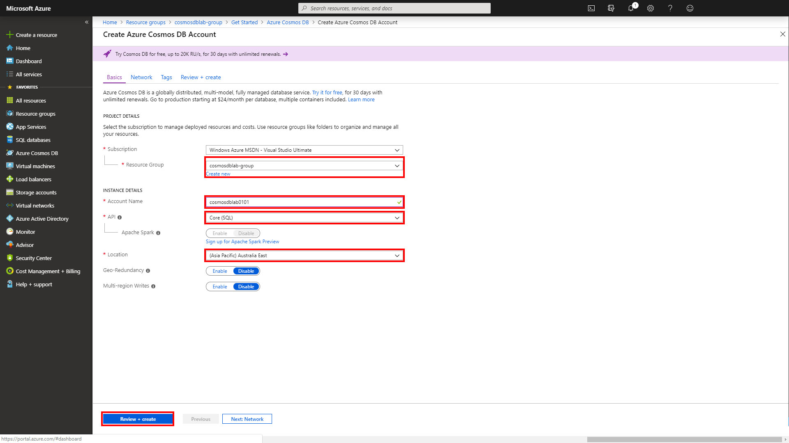

1. When you're ready, in the review window click **Create**

> Creating a new Azure Cosmos DB account may take a few minutes. Once it completes, proceed to the next step.

### Create Azure Cosmos DB Database and Containers

_You will now create a database and several containers within your Azure Cosmos DB account_

1. On the left side of the portal, click the **Resource groups** link.

   

1. In the **Resource groups** blade, locate and select the **cosmosdblab-group** _Resource Group_.

   

1. In the **cosmosdblab-group** blade, select the Cosmos DB Account that you just created.

   

1. In the **Azure Cosmos DB** blade, locate and click the **Overview** link on the left side of the blade.

   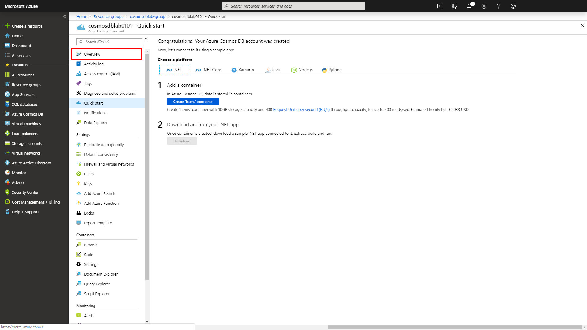

1. At the top of the **Azure Cosmos DB** blade, click the **Add Container** button.

   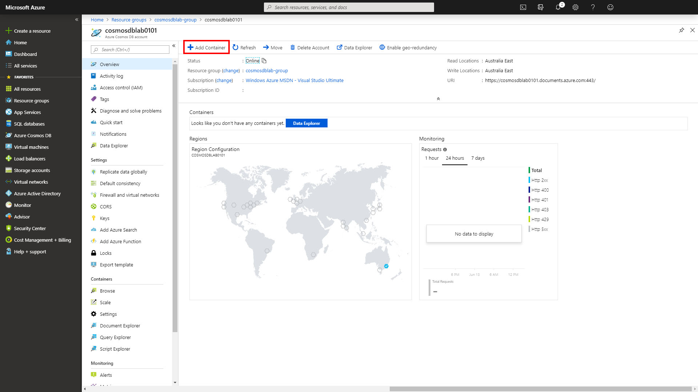

1. In the **Add Container** popup, perform the following actions:

   1. In the **Database id** field, select the **Create new** option and enter the value **StoreDatabase**.

   1. Ensure the **Provision database throughput** option is not selected.

      > Provisioning throughput for a database allows you to share the throughput among all the containers that belong to that database. Within an Azure Cosmos DB database, you can have a set of containers which shares the throughput as well as containers, which have dedicated throughput.

   1. In the **Container Id** field, enter the value **CartContainer**.

   1. In the **Partition key** field, enter the value `/Item`.

   1. In the **Throughput** field, enter the value `1000`.

   1. Click the **OK** button.

   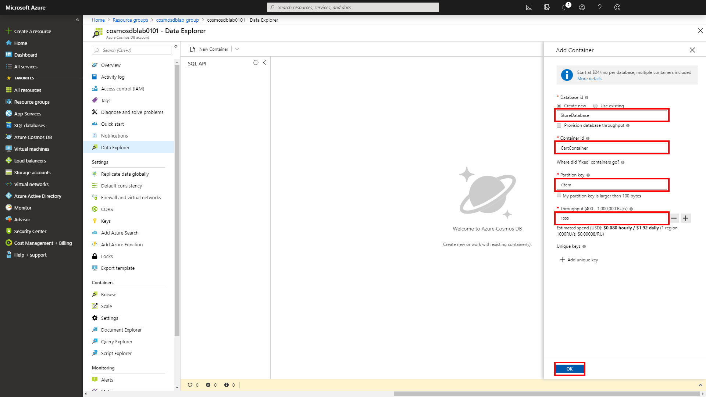

1. Wait for the creation of the new **database** and **container** to finish before moving on with this lab.

1. You need to create two additional **containers** for this lab. For each, you can utilize the **New Container** but at the top of the **Data Explorer** window, or return to the **Overview** tab.

   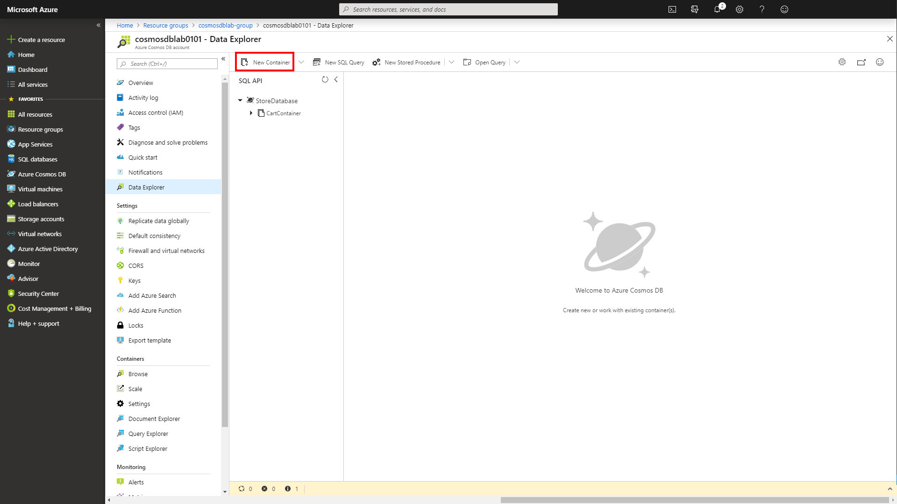

1. For the first additional container, utilize the following values

   1. In the **Database id** field, select the **Use existing** option and select the **StoreDatabase**.

   1. In the **Container id** field, enter the value **CartContainerByState**

   1. In the **Partiion key** field, enter the value `/BuyerState`

   1. In the **Throughput** field, enter the value `1000`

   1. Click the **OK** button.

1. To create the final contianer, follow the same steps as above but utilize the following values:

   1. In the **Container id** field, enter the value **StateSales**

   1. In the **Partition key** field, enter the value `/State`

1. Once all three containers have been created, your Data Explorer should look like this:

   

### Retrieve Account Credentials

_The .NET SDK requires credentials to connect to your Azure Cosmos DB account. You will collect and store these credentials for use throughout the lab._

1. On the left side of the **Azure Cosmos DB** blade, locate the **Settings** section and click the **Keys** link.

   

1. In the **Keys** pane, record the values in the **PRIMARY CONNECTION STRING**, **URI** and **PRIMARY KEY** fields. You will use these values later in this lab.

   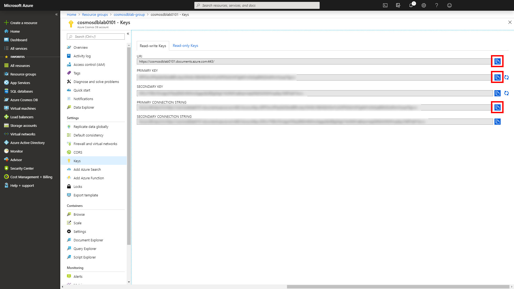

## Build A .NET Console App to Generate Data

_In order to simulate data flowing into our store, in the form of actions on an ecommerce website, we'll build a simple .NET Console App to generate and add documents to our Cosmos DB CartContainer_

1. On your local machine, create a new folder that will be used to contain the content of your .NET Core project.

1. Open a terminal window and navigate to the folder that you created in the previous step

1. In the terminal window, enter and execute the following command:

   ```sh
   dotnet new console -o DataGenerator
   ```

> This command will create a new .NET Core 2.1 project. This project will be a **console** project and the project will be crated in a new directory called **DataGenerator**

1.  Change directory to the **DataGenerator** folder

1.  In the terminal pane, enter and execute the following command:

    ```sh
    dotnet add package Microsoft.Azure.Cosmos --version 3.0.0.17-preview
    ```

    > This command will add the [Microsoft.Azure.Cosmos](https://www.nuget.org/packages/Microsoft.Azure.Cosmos/) NuGet package as a project dependency.

1.  In the terminal pane, enter and execute the following command:

    ```sh
    dotnet add package Bogus --version 27.0.1
    ```

    > This command will add the [Bogus]() NuGet package, which you'll use to generate randomized shopping data.

1.  Change directory back to your root folder

1.  In the terminal pane, open Visual Studio code with the following command:

    ```sh
    code .
    ```

1.  Observe the **Program.cs** and **DataGenerator.csproj** files created by the .NET Core CLI.

    

1.  Double-click the **DataGenerator.csproj** link in the **Explorer** pane to open the file in the editor.

1.  Add a new **PropertyGroup** XML element to the project configuration within the **Project** element:

    ```xml
    <PropertyGroup>
        <LangVersion>Latest</LangVersion>
    </PropertyGroup>
    ```

1.  Your new XML should look like this:

    ```xml
    <Project Sdk="Microsoft.NET.Sdk">
        <PropertyGroup>
            <OutputType>Exe</OutputType>
            <TargetFramework>netcoreapp2.2</TargetFramework>
        </PropertyGroup>
        <PropertyGroup>
            <LangVersion>Latest</LangVersion>
        </PropertyGroup>
        <ItemGroup>
            <PackageReference Include="Bogus" Version="27.0.1" />
            <PackageReference Include="Microsoft.Azure.Cosmos" Version="3.0.0.17-preview" />
        </ItemGroup>
    </Project>
    ```

1.  Double-click the **Program.cs** link in the **Explorer** pane to open the file in the editor.

    

### Create Function to Add Documents to Cosmos DB

_The key functionality of the console application is to add documents to our Cosmos DB to simulate activity on our ecommerce website. Here, you'll create a data definition for these documents and define a function to add them_

1. Within the **Program.cs** editor tab, Add the following using blocks to the top of the editor:

   ```csharp
   using System.Threading.Tasks;
   using Microsoft.Azure.Cosmos;
   using Newtonsoft.Json;
   using Newtonsoft.Json.Converters;
   ```

1. Locate the **Program** class and replace it with the following class:

   ```csharp
   public class Program
   {
       public static async Task Main(string[] args)
       {
       }
   }
   ```

1. Within the **Program** class, add the following lines of code to create variables for your connection information:

   ```csharp
   private static readonly string _endpointUrl = "";
   private static readonly string _primaryKey = "";
   private static readonly string _databaseId = "StoreDatabase";
   private static readonly string _containerId = "CartContainer";
   ```

1. For the `_endpointUrl` variable, replace the placehodler value with the **URI** value for your Azure Cosmos DB account that you recorded earlier in this lab.

1. For the `_primaryKey` variable, replace the placeholder value with the **PRIMARY KEY** value from your Azure Cosmos DB account that you recorded earlier in this lab.

1. Location the **Main** method:

   ```csharp
   public static async Task Main(string[] args)
   {
   }
   ```

1. After the **Main** method, define the **CartAction** class and an enum called **ActionType**.

   ```csharp
   public enum ActionType
   {
       Viewed,
       Added,
       Purchased
   }

   public class CartAction
   {
       [JsonProperty("id")]
       public string Id {get; set;}
       public int CartId {get; set;}
       [JsonConverter(typeof(StringEnumConverter))]
       public ActionType Action {get; set;}
       public string Item {get; set;}
       public double Price {get; set;}
       public string BuyerState {get; set;}

       public CartAction()
       {
           Id = Guid.NewGuid().ToString();
       }
   }
   ```

   > The `id` property is required by Cosmos DB to be a string that is not greater than 255 chars and unique in the container. We auto-generate the id here in the constructor as a **GUID** to ensure uniqueness.

1. In between the **Main** method and the class definitions, add the following function:

   ```csharp
   private static async Task AddItem(CartAction item)
   {
       using(var client = new CosmosClient(_endpointUrl, _primaryKey))
       {
           var db = client.GetDatabase(_databaseId);
           var container = db.GetContainer(_containerId);

           await container.CreateItemAsync(item, new PartitionKey(item.Item));
       }
   }
   ```

   > The **CosmosClient** class is the main entry point to the API for Azure Cosmos DB. You'll see this pattern again any time we are communicating with our Cosmos DB throughout this lab.

### Create a Function to Generate Random Shopping Data

_Now that you have a function to add documents to Cosmos DB you'll need a way to generate those documents. We'll use the *Randomizer* class in the Bogus library to help with this step_

1. Within the **Program.cs** editor tab, add the following using block to the top of the editor:

   ```csharp
   using Bogus;
   using System.Collections.Generic;
   ```

1. The full list of using should now look like this:

   ```csharp
   using System;
   using System.Threading.Tasks;
   using Microsoft.Azure.Cosmos;
   using Newtonsoft.Json;
   using Newtonsoft.Json.Converters;
   using Bogus;
   using System.Collections.Generic;
   ```

1. In between the **Main** method and the **AddItem** function, add a new function:

   ```csharp
   private static List<CartAction> GenerateActions()
   {
       Randomizer random = new Randomizer();

       var items = new string[]{};
       var states = new string[]{};
       var prices = new double[]{};

       var actions = new List<CartAction>();

       // create actions

       return actions;
   }
   ```

   > There are three collections in this function, `items`, `states` and `prices` that will be used to generate cart actions. The initial value of these collections are ommitted for now to make the code easier to read. We'll add them in a few steps.

1. The next steps will focus on the lines where the comment `// create actions` is currently sitting.

1. In order to generate a random item, we'll use Randomizer to select an item and state index for our new item, and create a CartAction based on those values. Add the following code after `// create actions`.

   ```csharp
   var itemIndex = random.Number(0, items.Length - 1);
   var stateIndex = random.Number(0, states.Length - 1);

   var action = new CartAction
   {
       CartId = random.Number(1000, 99999),
       Action = random.Enum<ActionType>(),
       Item = items[itemIndex],
       Price = prices[itemIndex],
       BuyerState = states[stateIndex]
   };
   ```

1. If the action is anything other than **Viewed** we need to add the previous action(s) that led up to this action. To do that, add the following code snippet:

   ```csharp
   if(action.Action != ActionType.Viewed)
   {
       var previousActions = new List<ActionType> {ActionType.Viewed};

       if(action.Action != ActionType.Purchased)
       {
           previousActions.Add(ActionType.Added);
       }

       foreach(var previousAction in previousActions)
       {
           var previous = new CartAction
           {
               CartId = action.CartId,
               Action = previousAction,
               Item = action.Item,
               Price = action.Price,
               BuyerState = action.BuyerState
           };

           actions.Add(previous);
       }
   }

   ```

1. Finally, we'll add the new action to the list of actions, prior to returning:

   ```csharp
   actions.Add(action);
   ```

1. The **GenerateActions** function should now look like this:

   ```csharp
    private static List<CartAction> GenerateActions()
    {
        Randomizer random = new Randomizer();

        var items = new string[]{};

        var states = new string[]{};

        var prices = new double[]{};

        var actions = new List<CartAction>();

        var itemIndex = random.Number(0, items.Length - 1);
        var stateIndex = random.Number(0, states.Length - 1);

        var action = new CartAction
        {
            CartId = random.Number(1000, 99999),
            Action = random.Enum<ActionType>(),
            Item = items[itemIndex],
            Price = prices[itemIndex],
            BuyerState = states[stateIndex]
        };

        if (action.Action != ActionType.Viewed)
        {
            var previousActions = new List<ActionType> { ActionType.Viewed };

            if (action.Action == ActionType.Purchased)
            {
                previousActions.Add(ActionType.Added);
            }

            foreach (var previousAction in previousActions)
            {
                var previous = new CartAction
                {
                    CartId = action.CartId,
                    Action = previousAction,
                    Item = action.Item,
                    Price = action.Price,
                    BuyerState = action.BuyerState
                };

                actions.Add(previous);
            }
        }

        actions.Add(action);
        return actions;
    }
   ```

1. In order to have actual data, you'll need to assign the values of `items`, `states` and `prices` to some test data. Modify those lines as follows:

   ```csharp
   var items = new string[]
       {
           "Unisex Socks", "Women's Earring", "Women's Necklace", "Unisex Beanie",
           "Men's Baseball Hat", "Unisex Gloves", "Women's Flip Flop Shoes", "Women's Silver Necklace",
           "Men's Black Tee", "Men's Black Hoodie", "Women's Blue Sweater", "Women's Sweatpants",
           "Men's Athletic Shorts", "Women's Athletic Shorts", "Women's White Sweater", "Women's Green Sweater",
           "Men's Windbreaker Jacket", "Women's Sandal", "Women's Rainjacket", "Women's Denim Shorts",
           "Men's Fleece Jacket", "Women's Denim Jacket", "Men's Walking Shoes", "Women's Crewneck Sweater",
           "Men's Button-Up Shirt", "Women's Flannel Shirt", "Women's Light Jeans", "Men's Jeans",
           "Women's Dark Jeans", "Women's Red Top", "Men's White Shirt", "Women's Pant", "Women's Blazer Jacket", "Men's Puffy Jacket",
           "Women's Puffy Jacket", "Women's Athletic Shoes", "Men's Athletic Shoes", "Women's Black Dress", "Men's Suit Jacket", "Men's Suit Pant",
           "Women's High Heel Shoe", "Women's Cardigan Sweater", "Men's Dress Shoes", "Unisex Puffy Jacket", "Women's Red Dress", "Unisex Scarf",
           "Women's White Dress", "Unisex Sandals", "Women's Bag"
       };

       var states = new string[]
       {
           "AL","AK","AS","AZ","AR","CA","CO","CT","DE","DC","FM","FL","GA","GU","HI","ID","IL","IN",
           "IA","KS","KY","LA","ME","MH","MD","MA","MI","MN","MS","MO","MT","NE","NV","NH","NJ","NM",
           "NY","NC","ND","MP","OH","OK","OR","PW","PA","PR","RI","SC","SD","TN","TX","UT","VT","VI",
           "VA","WA","WV","WI","WY"
       };

       var prices = new double[]
       {
           3.75, 8.00, 12.00, 10.00,
           17.00, 20.00, 14.00, 15.50,
           9.00, 25.00, 27.00, 21.00, 22.50,
           22.50, 32.00, 30.00, 49.99, 35.50,
           55.00, 50.00, 65.00, 31.99, 79.99,
           22.00, 19.99, 19.99, 80.00, 85.00,
           90.00, 33.00, 25.20, 40.00, 87.50, 99.99,
           95.99, 75.00, 70.00, 65.00, 92.00, 95.00,
           72.00, 25.00, 120.00, 105.00, 130.00, 29.99,
           84.99, 12.00, 37.50
       };
   ```

### Putting it all together

_At this point, all that is left is to call the function to generate the data from your console application, and pass the result to our AddItem function for persistence._

1. Locate the **Main** method

   ```csharp
   static async Task Main(string[] args)
   {
   }
   ```

1. Within the **Main** method, add the following code:

   ```csharp
   Console.WriteLine("Press any key to stop the console app...");

   var tasks = new List<Task>();

   while(!Console.KeyAvailable)
   {
       foreach(var action in GenerateActions())
       {
           tasks.Add(AddItem(action));
           Console.Write("*");
       }
   }

   await Task.WhenAll(tasks);
   ```

   > This code uses the console to print an asterisk each time a record is written, just to help us keep track of progress. Pressing any key will stop the console app.

### Run the Console App and Verify Functionality

_You're ready to run the console app, and in this step you'll take a look at you Cosmos DB account to ensure test data is being written as expected._

1. Open a terminal window, and navigate to the **DataGenerator** folder from the previous step.

1. In the terminal pane, enter and execute the following command to run your console app:

   ```sh
   dotnet run
   ```

1. After a brief build process, you should begin to see the asterisks being printed as data is being generated and written to Cosmos DB.

   

1. Let the console app run for a minute or two and then stop it by pressing any key in the console.

1. Follow the previous steps to navigate back to your **cosmosdblab** Cosmos DB Account.

1. From within the **Azure Cosmos DB** blade, select the **Data Explorer** tab on the left.

   

1. Expand the **StoreDatabase** then the **CartContainer** and select **Items** If all goes well, you should see something like the following screenshot.

   _Note your data will be slightly different since it is random, the important thing is that there is data here at all_

   

## Create an Azure Function to Consume Cosmos DB Change Feed

_One of the more interesting features of Azure Cosmos DB is its change feed. The change feed provides support for many scenarios, three of which we'll investigate further in this lab._

### Create a .NET Core Azure Functions Project

_Azure Functions provide a quick and easy way to hook up with the Cosmos DB Change Feed in a way that is scalable out of the box. You'll start by setting up a.NET Core Azure Functions project_

1. Open a terminal window and navigate to the root folder you created for this lab.

1. To install command line support for Azure Functions, you'll need `node.js`. If you do not already have node, or you're using a version older than 8.5, [Download it here](https://docs.npmjs.com/getting-started/installing-node#osx-or-windows)

1. In your terminal pane, enter and execute the following command:

   ```sh
   npm install -g azure-functions-core-tools
   ```

   > If this command fails, refer to the previous step to setup node.js. You may need to restart your terminal window for these changes to take effect.

1. In your terminal pane, enter and execute the following command:

   ```sh
   func init ChangeFeedFunctions
   ```

   1. When prompted, choose the **dotnet** _worker runtime_

   > This command creates a new Azure Functions project

1. Change directory to the ChangeFeedFunctions directory created in the previous step

1. In your terminal pane, enter and execute the following command:

   ```sh
   func new
   ```

   1. When prompted, select **CosmosDBTrigger** from the list of templates

   2. When prompted, enter the name **MigrationFunction** for the function

1. In your terminal pane, enter and execute the following command:

   ```sh
   dotnet add package Microsoft.Azure.Cosmos --version 3.0.0.17-preview
   ```

1. Your first Azure Function has been created, switch back to Visual Studio Code and note the new **ChangeFeedFunctions** folder, expand it and note **local.settings.json**, and the **MigrationFunction.cs**.

   

### Create an Azure Function for Live Migration using Cosmos DB Change Feed

_The first use case we'll explore for Cosmos DB Change Feed is Live Migration. A common concern when designing a Cosmos DB container is proper selection of a partition key. You'll recall that we created our CartContainer with a partition key of /Item. What if we find out later this key is wrong? Or what if writes work better with /Item while reads work better with /BuyerState as the partition key? We can avoid analysis paralysis by using Cosmos DB Change Feed to migrate our data in real time to a second container with a different partition key!_

1. Locate the **local.settings.json** file and double click it to open it in the editor.

1. Add a new value **DBConnection** using the **Primary Connection String** parameter from your Cosmos DB account collected earlier in this lab. The **local.settings.json** file should like this:

   ```json
   {
     "IsEncrypted": false,
     "Values": {
       "AzureWebJobsStorage": "UseDevelopmentStorage=true",
       "FUNCTIONS_WORKER_RUNTIME": "dotnet",
       "DBConnection": "<your-db-connection-string>"
     }
   }
   ```

1. Now locate the **MigrationFunction.cs** file and double click on it to open it in the editor. You'll see that an Azure Function template has already been created for you with Cosmos DB as the trigger.

   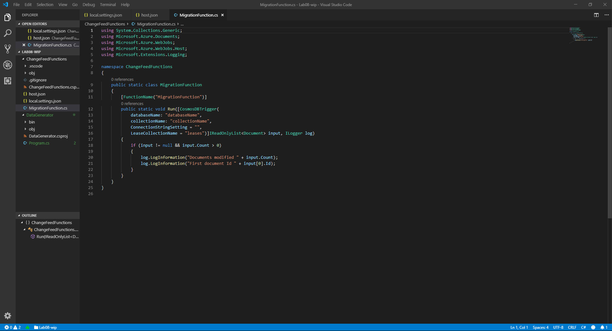

   > The **databaseName**, **collectionName** and **ConnectionStringSetting** refer to the source Cosmos DB account that the function is listening for changes on.

1. Change the **databaseName** value to `StoreDatabase`

1. Change the **collectionName** value to `CartContainer`

1. Replace the **ConnectionStringSetting** placeholder with the new setting you added earlier **DBConnection**

   ```csharp
   ConnectionStringSetting = "DBConnection",
   ```

1. Between **ConnectionStringSetting** and **LeaseCollectionName** add the following line:

   ```csharp
   CreateLeaseCollectionIfNotExists = true,
   ```

1. Change the **LeaseCollectionName** value to `migrationLeases`

   > Lease collections are a critical part of the Cosmos DB Change Feed. They allow multiple instances of a function to operate over a collection and serve as a virtual _bookmark_ for where the function last left off.

1. Your **Run** function should now look like this:

   ```csharp
   [FunctionName("MigrationFunction")]
   public static void Run([CosmosDBTrigger(
       databaseName: "StoreDatabase",
       collectionName: "CartContainer",
       ConnectionStringSetting = "DBConnection",
       CreateLeaseCollectionIfNotExists = true,
       LeaseCollectionName = "migrationLeases")]IReadOnlyList<Document> input, ILogger log)
   {
       if (input != null && input.Count > 0)
       {
           log.LogInformation("Documents modified " + input.Count);
           log.LogInformation("First document Id " + input[0].Id);
       }
   }
   ```

> The function works by polling your container on an interval and checking for changes since the last lease time. Each turn of the function may result in multiple documents that have changed, which is why the input is an IReadOnlyList of Documents.

### Create a Shared Project to Share Data Definitions

_The MigrationFunction we just created is going to need access to the defintions of the CartAction and ActionType enum that we defined in our console app. To promote sharing, you'll create a new Shared class library and move the data definitions there._

1. Open your terminal window, and change directory to the root folder you created for this lab.

1. In the terminal pane, enter and execute the following command:

   ```sh
   dotnet new classlib -o Shared
   ```

1. Add a reference to **Shared** from the **DataGenerator** project by entering and executing the following command:

   ```sh
   dotnet add DataGenerator\\DataGenerator.csproj reference shared\\shared.csproj
   ```

1. Add a refernece to **Shared** from the **ChangeFeedFunctions** project by entering and executing the following command:

   ```sh
   dotnet add ChangeFeedFunctions\\ChangeFeedFunctions.csproj reference shared\\shared.csproj
   ```

1. Change directory to the new Shared project

1. In the open terminal pane, enter and execute the following command

   ```sh
   dotnet add package Newtonsoft.Json --version 11.0.2
   ```

1. Return to Visual Studio Code and note the new **Shared** folder.

1. Rename the generated **Class1.cs** file under **Shared** to **DataModels.cs**

1. Open the **DataModels.cs** class and add the following usings:

   ```csharp
   using Newtonsoft.Json;
   using Newtonsoft.Json.Converters;
   ```

1. Open the **Program.cs** file from the **DataGenerator** folder and cut the **ActionType** enum and **CartAction** class definitions.

1. Paste those class definitions into the **DataModels.cs** file overwiting the **Class1** definition. **DataModels.cs** should now look like this:

   ```csharp
    using System;
    using Newtonsoft.Json;
    using Newtonsoft.Json.Converters;

    namespace Shared
    {
        public enum ActionType
            {
                Viewed,
                Added,
                Purchased
            }

            public class CartAction
            {
                [JsonProperty("id")]
                public string Id { get; set; }

                public int CartId { get; set; }
                [JsonConverter(typeof(StringEnumConverter))]
                public ActionType Action { get; set; }
                public string Item { get; set; }
                public double Price { get; set; }
                public string BuyerState { get; set; }

                public CartAction()
                {
                    Id = Guid.NewGuid().ToString();
                }

            }
    }
   ```

1. Return to **Program.cs** and add the following using:

   ```csharp
   using Shared;
   ```

   > You may also remove the usings for Newtonsoft.Json and Newtonsoft.Json.Converters

### Modify the Azure Function to do Live Data Migration

1. Open the **MigrationFunction.cs** file in the editor, and add the following using to the top of the file:

   ```csharp
   using System.Threading.Tasks;
   using Shared;
   using Microsoft.Azure.Cosmos;
   using Newtonsoft.Json;
   ```

1. Remember the **CartContainerByState** container that we made earlier in this lab? We're going to use that as the destination of our migration. Add the following lines to the top of the **MigrationFunction** class:

   ```csharp
   private static readonly string _endpointUrl = "<your-endpoint-url>";
   private static readonly string _primaryKey = "<your-primary-key>";
   private static readonly string _databaseId = "StoreDatabase";
   private static readonly string _containerId = "CartContainerByState";
   ```

   > The \_endpointUrl, \_primaryKey and \_databaseId will all be the same in our case, but they don't have to be. You could be migrating this data to a Cosmos DB located in any account, any database and any container!

1. Modify the signature of the **Run** function to be async, like this:

   ```csharp
   public static async Task Run([CosmosDBTrigger(
           databaseName: "StoreDatabase",
           collectionName: "CartContainer",
           ConnectionStringSetting = "DBConnection",
           CreateLeaseCollectionIfNotExists = true,
           LeaseCollectionName = "migrationLeases")]IReadOnlyList<Document> input, ILogger log)
   ```

1. Locate the following section within the **MigrationFunction.cs** file:

   ```csharp
   if (input != null && input.Count > 0)
   {
       log.LogInformation("Documents modified " + input.Count);
       log.LogInformation("First document Id " + input[0].Id);
   }
   ```

1. Remove the two log.LogInformation lines and replace them with our now familiar recipe for accessing a Cosmos DB container:

   ```csharp
   if(input != null && input.count > 0)
   {
       using(var client = new CosmosClient(_endpointUrl, _primaryKey))
       {
           var db = client.GetDatabase(_databaseId);
           var container = db.GetContainer(_containerId);

           // todo: Next steps
       }
   }
   ```

1. The **input** variable contains a list of _Documents_ that have changed. We'll iterate through that list, deserialize those objects to CartActions and write them to the destination Cosmos DB account. Like this:

   ```csharp
   foreach(var doc in input){
       var cartAction = JsonConvert.DeserializeObject<CartAction>(doc.ToString());

       if(cartAction == null) continue;

       await container.CreateItemAsync(cartAction, new Microsoft.Azure.Cosmos.PartitionKey(cartAction.BuyerState));
   }
   ```

   > Take note of the lack of error handling here. If something happens during this process, the changes will be lost. It is highly recommended that you create your function logic within a try/catch and write actions out to a queue in the case of an error.

1. Thats it, you should now have a **MigrationFunction** that looks like the following:

   ```csharp
    using System;
    using System.Collections.Generic;
    using Microsoft.Azure.Documents;
    using Microsoft.Azure.WebJobs;
    using Microsoft.Azure.WebJobs.Host;
    using Microsoft.Extensions.Logging;
    using Newtonsoft.Json;
    using Shared;
    using Microsoft.Azure.Cosmos;
    using System.Threading.Tasks;

   namespace ChangeFeedFunctions
   {
       public static class MigrationFunction
       {
           private static readonly string _endpointUrl = "<your-endpoint-url>";
           private static readonly string _primaryKey = "<your-primary-key>";
           private static readonly string _databaseId = "StoreDatabase";
           private static readonly string _containerId = "CartContainerByState";

           [FunctionName("MigrationFunction")]
           public static async Task Run([CosmosDBTrigger(
               databaseName: "StoreDatabase",
               collectionName: "CartContainer",
               ConnectionStringSetting = "DBConnection",
               CreateLeaseCollectionIfNotExists = true,
               LeaseCollectionName = "migrationLeases")]IReadOnlyList<Document> input, ILogger log)
           {
               if (input != null && input.Count > 0)
               {
                   using (var client = new CosmosClient(_endpointUrl, _primaryKey))
                   {
                       var db = client.GetDatabase(_databaseId);
                       var container = db.GetContainer(_containerId);

                       foreach (var doc in input)
                       {
                           var cartAction = JsonConvert.DeserializeObject<CartAction>(doc.ToString());

                           if (cartAction == null) continue;

                           log.LogInformation("Writing Migration Data");
                           await container.CreateItemAsync(cartAction, new Microsoft.Azure.Cosmos.PartitionKey(cartAction.BuyerState));
                       }
                   }
               }
           }
       }
   }

   ```

   > Note the addition of the log.LogInformation call just so that we get some feedback in the console that the function is running.

### Test to Confirm the Change Feed Function Works

_Now that we have our first Change Feed consumer, we're ready to run a test and confirm that it works_

1. Open a **second** terminal window and navigate to the **ChangeFeedFunctions** folder

1. Start up your **MigrationFunction** by running the following command in the **second** terminal window:

   ```sh
   func host start
   ```

1. Once the function starts running you'll see a message like this in the console window:

   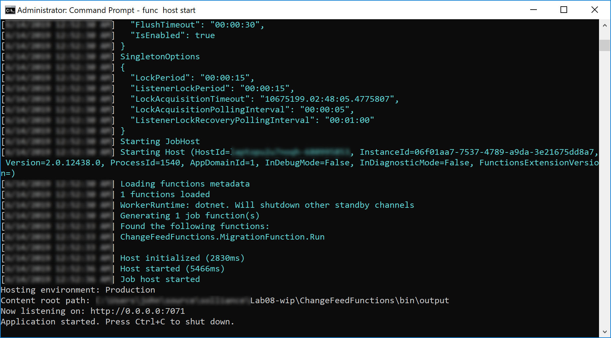

1. In the **first** terminal window, navigate to the **DataGenerator** folder

1. Start the **DataGenerator** again by running the following command in the **first** terminal window

   ```sh
   dotnet run
   ```

1. You should see the asterisks start to appear again as the data is being written.

1. Soon after data starts being written, if you added the LogInformation line to your function you should start to see it writing migration data.

1. After a few minutes, navigate to the **cosmosdblab** Data Explorer and expand **StoreDatabase** then **CartContainerByState** and click **Items**. You should see items populating there, and note that the Partition Key this time is /BuyerState.

   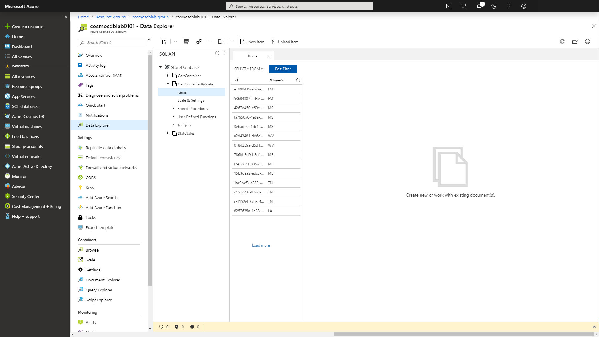

1. Press any key in the **first** terminal to stop data generation

1. Let the **MigrationFunction** finish running (it shouldn't take very long). You'll know it's done when it stops writing new log messages. Stop the function with Ctrl+C in the **second** terminal window.

> You've now written your first Azure Function that reads from the Cosmos DB Change Feed and writes live data to a new collection. Congrats! In the next steps we'll write two more functions to explore some additional uses cases for the Cosmos DB Change Feed.

## Use Cosmos DB Change Feed for the Materialized View Pattern

_The Materialized View pattern is used to generate pre-populated views of data in environments where the source data format is not well suited to the applications requirements. In this example, we'll create a real time collection of sales data aggregated by State that would allow another application to quickly retrieve summary sales data_

### Create the Materialized View Azure Function

1. In your terminal window, change directory back to the **ChangeFeedFunctions** folder

1. Create a new Azure Function using the following command, as before:

   ```sh
   func new
   ```

   1. When prompted, select **CosmosDBTrigger** as the _template_

   1. When prompted, enter **MaterializedViewFunction** as the _name_

1. Open Visual Studio Code and note the new **MaterializedViewFunction.cs** file. Double click it to open it in the editor.

1. Add the following usings to the top of the **MaterializedViewFunction.cs** file:

   ```csharp
   using System.Threading.Tasks;
   using System.Linq;
   using Newtonsoft.Json;
   using Microsoft.Azure.Cosmos;
   using Shared;
   ```

> We once again need to set **databaseName**, **collectionName** and **ConnectionStringSetting**. **databaseName** and **ConnectionString** setting will be the same as before (`StoreDatabase` and `DBConnection` respectively) but the **collectionName** is different. Recall that these are our source settings and our goal is to write out an aggregate collection by state. Cosmos DB Change Feeds are guaranteed to be in order within a partition, so in this case we want to target the Container where the partition is already set to the State, `CartContainerByState`.

1. Set **databaseName** to `StoreDatabase`, **collectionName** to `CartContainerByState` and **ConnectionStringSetting** to `DBConnection`.

1. Add the following line after the **ConnectionStringSetting**:

   ```csharp
   CreateLeaseCollectionIfNotExists = true,
   ```

1. Change the **LeaseCollectionName** to `materializedViewLeases`

1. Modify the signature of the **Run** function to be async. Your function should now look like the following:

   ```csharp
   [FunctionName("MaterializedViewFunction")]
    public static async Task Run([CosmosDBTrigger(
        databaseName: "StoreDatabase",
        collectionName: "CartContainerByState",
        ConnectionStringSetting = "DBConnection",
        CreateLeaseCollectionIfNotExists = true,
        LeaseCollectionName = "materializedViewLeases")]IReadOnlyList<Document> input, ILogger log)
    {
        if (input != null && input.Count > 0)
        {
            log.LogInformation("Documents modified " + input.Count);
            log.LogInformation("First document Id " + input[0].Id);
        }
    }
   ```

1. Your target this time is the container you created previously called **StateSales**. Add the following lines to the top of the **MaterializedViewFunction** to setup the destination connection.

   ```csharp
    private static readonly string _endpointUrl = "<your-endpoint-url>";
    private static readonly string _primaryKey = "<your-primary-key>";
    private static readonly string _databaseId = "StoreDatabase";
    private static readonly string _containerId = "StateSales";
   ```

### Add a new Class for StateSales Data

1. Open **DataModel.cs** within the **Shared** folder in the editor

1. Following the definition of the **CartAction** class, add a new class as follows:

   ```csharp
   public class StateCount
   {
       [JsonProperty("id")]
       public string Id { get; set; }
       public string State { get; set; }
       public int Count { get; set; }
       public double TotalSales { get; set; }

       public StateCount()
       {
           Id = Guid.NewGuid().ToString();
       }
   }
   ```

### Update the MaterializedViewFunction to Create the Materialized View

1. Switch back to the **MaterializedViewFunction.cs** file in the editor

> The Azure Function receives a list of Documents that have changed. We want to organize this list into a dictionary keyed off of the state of each document and keep track of the total price and count of items purchased. We'll use this dictionary later to write data to our materialized view collection **StateSales**

1. Locate the following section in the code for **MaterializedViewFunction.cs**

   ```csharp
    if (input != null && input.Count > 0)
    {
        log.LogInformation("Documents modified " + input.Count);
        log.LogInformation("First document Id " + input[0].Id);
    }
   ```

1. Replace the two logging lines with the following code:

   ```csharp
    var stateDict = new Dictionary<string, List<double>>();
    foreach (var doc in input)
    {
        var action = JsonConvert.DeserializeObject<CartAction>(doc.ToString());

        if (action.Action != ActionType.Purchased)
        {
            continue;
        }

        if (stateDict.ContainsKey(action.BuyerState))
        {
            stateDict[action.BuyerState].Add(action.Price);
        }
        else
        {
            stateDict.Add(action.BuyerState, new List<double> { action.Price });
        }
    }
   ```

1. Following the conclusion of this _foreach_ loop, add the typical code to connect to our destination container:

   ```csharp
   using(var client = new CosmosClient(_endpointUrl, _primaryKey))
   {
       var db = client.GetDatabase(_databaseId);
       var container = db.GetContainer(_containerId);

       //todo - Next steps go here
   }
   ```

1. Because we're dealing with an aggregate collection, we'll be either creating or updating a document for each entry in our dictionary. For starters, we need to check to see if the document we care about exists. Add the following code:

   ```csharp
   var tasks = new List<Task>();

   foreach (var key in stateDict.Keys)
   {
       var query = new CosmosSqlQueryDefinition("select * from StateSales s where s.State = @state").UseParameter("@state", key);

       var resultSet = container.CreateItemQuery<StateCount>(query, partitionKey: new Microsoft.Azure.Cosmos.PartitionKey(key), maxItemCount: 1);

       while (resultSet.HasMoreResults)
       {
           var stateCount = (await resultSet.FetchNextSetAsync()).FirstOrDefault();

           if (stateCount == null)
           {
               //todo: Add new doc code here
           }
           else
           {
               //todo: Add existing doc code here
           }

           //todo: Upsert document
       }
   }

   await Task.WhenAll(tasks);
   ```

   > Take note of the _maxItemCount_ on the **CreateItemQuery** call. We're only expecting a single result at most because each state has at most one document.

1. In the case that the stateCount object is _null_ we'll create a new one. Replace the `//todo: Add new doc code here` section with the following code:

   ```csharp
   stateCount = new StateCount();
   stateCount.State = key;
   stateCount.TotalSales = stateDict[key].Sum();
   stateCount.Count = stateDict[key].Count;
   ```

1. In the case that the stateCount object exists, we'll update it. Replace the `//todo: Add existing doc code here` section with the following code:

   ```csharp
    stateCount.TotalSales += stateDict[key].Sum();
    stateCount.Count += stateDict[key].Count;
   ```

1. Finally, we'll do an _upsert_ (Update or Insert) operation on our destination Cosmos DB account. Replace the `//todo: Upsert document` section with the following code:

   ```csharp
   log.LogInformation("Upserting materialized view document");
   tasks.Add(container.UpsertItemAsync(stateCount, new Microsoft.Azure.Cosmos.PartitionKey(stateCount.State)));
   ```

   > We're using a list of tasks here because we can do our upserts in parallel.

1. Your **MaterializedViewFunction** should now look like this:

   ```csharp
   using System.Collections.Generic;
   using System.Threading.Tasks;
   using Microsoft.Azure.Documents;
   using Microsoft.Azure.WebJobs;
   using Microsoft.Azure.WebJobs.Host;
   using Microsoft.Extensions.Logging;
   using System.Linq;
   using Newtonsoft.Json;
   using Microsoft.Azure.Cosmos;
   using Shared;

   namespace ChangeFeedFunctions
   {
       public static class MaterializedViewFunction
       {
           private static readonly string _endpointUrl = "<your-endpoint-url>";
           private static readonly string _primaryKey = "<primary-key>";
           private static readonly string _databaseId = "StoreDatabase";
           private static readonly string _containerId = "StateSales";

           [FunctionName("MaterializedViewFunction")]
           public static async Task Run([CosmosDBTrigger(
               databaseName: "StoreDatabase",
               collectionName: "CartContainerByState",
               ConnectionStringSetting = "DBConnection",
               CreateLeaseCollectionIfNotExists = true,
               LeaseCollectionName = "materializedViewLeases")]IReadOnlyList<Document> input, ILogger log)
           {
               if (input != null && input.Count > 0)
               {
                   var stateDict = new Dictionary<string, List<double>>();

                   foreach (var doc in input)
                   {
                       var action = JsonConvert.DeserializeObject<CartAction>(doc.ToString());

                       if (action.Action != ActionType.Purchased)
                       {
                           continue;
                       }

                       if (stateDict.ContainsKey(action.BuyerState))
                       {
                           stateDict[action.BuyerState].Add(action.Price);
                       }
                       else
                       {
                           stateDict.Add(action.BuyerState, new List<double> { action.Price });
                       }
                   }

                   using (var client = new CosmosClient(_endpointUrl, _primaryKey))
                   {
                       var db = client.GetDatabase(_databaseId);
                       var container = db.GetContainer(_containerId);

                       var tasks = new List<Task>();

                       foreach (var key in stateDict.Keys)
                       {
                           var query = new CosmosSqlQueryDefinition("select * from StateSales s where s.State = @state").UseParameter("@state", key);

                           var resultSet = container.CreateItemQuery<StateCount>(query, partitionKey: new Microsoft.Azure.Cosmos.PartitionKey(key), maxItemCount: 1);

                           while (resultSet.HasMoreResults)
                           {
                               var stateCount = (await resultSet.FetchNextSetAsync()).FirstOrDefault();

                               if (stateCount == null)
                               {
                                   stateCount = new StateCount();
                                   stateCount.State = key;
                                   stateCount.TotalSales = stateDict[key].Sum();
                                   stateCount.Count = stateDict[key].Count;
                               }
                               else
                               {
                                   stateCount.TotalSales += stateDict[key].Sum();
                                   stateCount.Count += stateDict[key].Count;
                               }

                               log.LogInformation("Upserting materialized view document");
                               tasks.Add(container.UpsertItemAsync(stateCount, new Microsoft.Azure.Cosmos.PartitionKey(stateCount.State)));
                           }
                       }

                       await Task.WhenAll(tasks);
                   }
               }
           }
       }
   }
   ```

### Test to Confirm the Materialized View Functions Works

1. Open two terminal windows.

1. In the **first** terminal window, navigate to the **DataGenerator** folder

1. In the **second** terminal window, navigate to the **ChangeFeedFunctions** folder

1. In the **second** terminal window, start the Azure Functions by entering and executing the following:

   ```sh
   func host start
   ```

   > Note that both the **MigrationFunction** and **MaterializedViewFunction** will begin executing. Data will pass from DataGenerator > CartContainer > MigrationFunction > CartContainerByState > MaterializedViewFunction > StateSales

1. In the **first** terminal window, start data generation again by entering and executing the following:

   ```sh
   dotnet run
   ```

1. You should see the asterisks in the **first** window as data is being generated, and in the **second** window you should see console messages indicating that your functions are running.

1. Open a browser window and navigate to the **cosmosdblab** Comsmos DB Data Explorer

1. Expand **StoreDatabase**, then **StateSales** and click **Items**

1. You should see data being populated in the container by state, click on an item to see the contents of the data.

   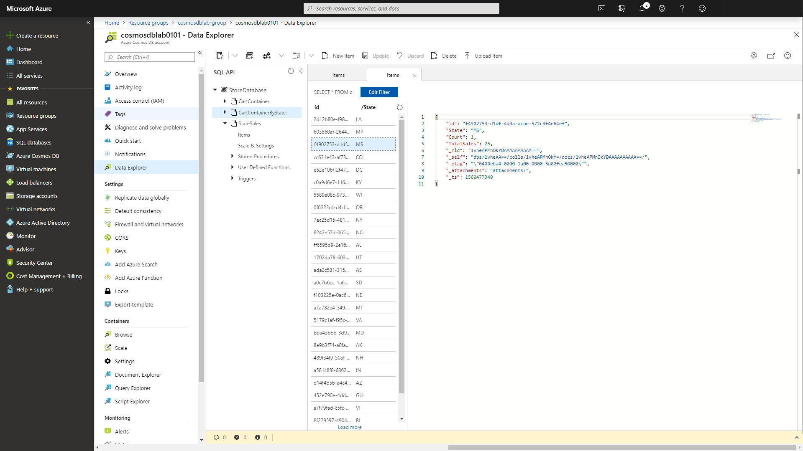

1. In the **first** terminal window, press any key to stop data generation

1. In the **second** terminal window, let the functions finish processing their data by waiting for the console log messages to stop. It should only take a few seconds. Then press Ctrl+C to end execution of the functions.

## Use Azure Cosmos DB Change Feed to Write Data to EventHub using Azure Functions

_In the final example of a Change Feed use case in this lab, you'll write a simple Azure Function to write out change data to an Azure Event Hub. You'll use a stream procesor to create real-time data outputs that you can consume in Power BI to build an ecommerce dashboard._

### Create a Power BI Account

_This step is optional, if you do not wish to follow the lab to creating the dashboard you can skip it_

> To sign up for a Power BI account, visit [the Power BI site](https://powerbi.microsoft.com/en-us/) and click **Sign up free**.

### Create an Azure Event Hub Account

1. Open an internet browser and navigate to the [Azure Portal](https://portal.azure.com)

1. On the left side of the portal, click the **Resource groups** link.

   

1. In the **Resource groups** blade, locate and select the **cosmosdblab-group** _Resource Group_.

   

1. In the **cosmosdblab-group** blade, click the **Add** button

   

1. Enter the term `Event Hubs` in the search bar and choose the first result

1. In the **Event Hubs** create window, click **Create**

   

1. In the **Create Namespace** blade, enter the following values:

   1. In the _Name_ field enter a name like `shoppingHub` with a random integer suffix. `shoppingHub2020` as an example.

   1. In the _Pricing tier_ drop down, select `Basic (1 Consumer Group, 100 Brokered Connections)`

   1. Leave the _Subscription_ drop down set to the **default** value

   1. Make sure the _Resoure group_ is set to **cosmosdblab-group**

   1. Choose a _Location_ that represents a region close to you

   1. Leave _Throughput Units_ set to 1

   1. Click **Create**

   

   > The Event Hub may take several moments to finish creation. When it is done, proceed to the next steps.

1. Return to the **cosmosdblab-group** resource blade, and select the Event Hub account you just created

   

1. In the **Event Hub** blade, find **Shared Access Policies** under **Settings** and select it

1. In the **Shared Access Policies** blade, select the policy **RootManageSharedAccessKey**

1. In the panel that appears, copy the value for **Connection string-primary key** and save it for use later in this lab.

   

1. In the left sidebar find **Event Hubs** under the **Entities** section and select it

1. In the **Event Hubs** blade, click the **Event Hub** button at the top of the screen

   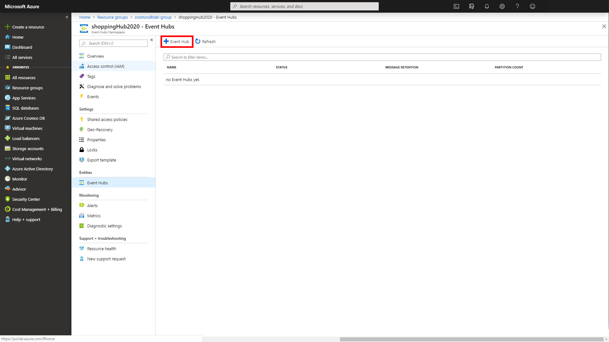

1. In the **Create Event Hub** blade that appears, enter the following values:

   1. In the _Name_ field enter `CartEventHub`

   1. Leave _Partition Count_ set to `2`

   1. Click **Create**

   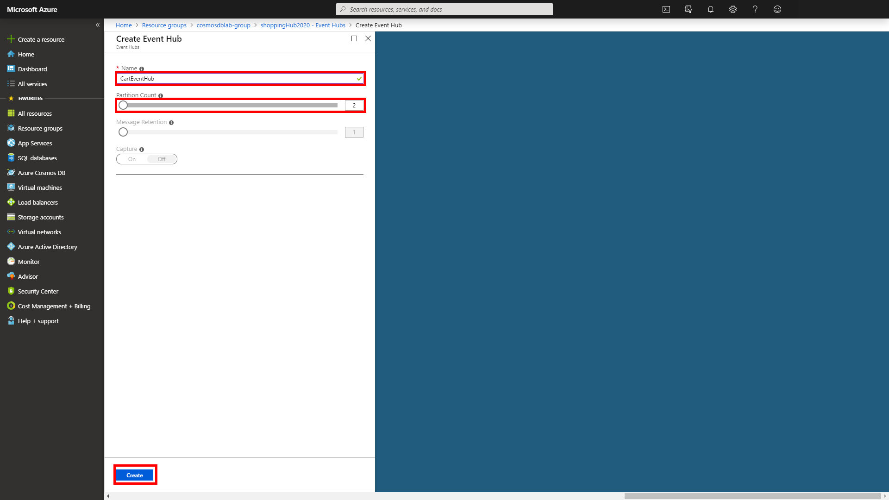

### Create an Azure Stream Analytics Job

1. Return to the **cosmosdblab-group** blade in the browser and select **Add** again

1. In the search bar enter `Stream Analytics Job` and select the first result

1. In the **Create Stream Analytics Job** blade that appears select **Create**

   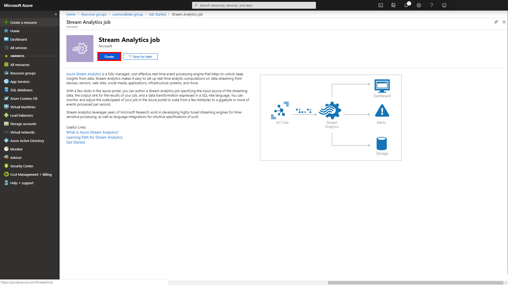

1. In the **New Stream Analytics Job** blade, enter the following information

   1. In the _Job name_ field enter `CartStreamProcessor`

   1. Leave the _Subscription_ set to its default value

   1. Ensure the _Resource group_ is set to **cosmosdblab-group**

   1. Choose a _Location_ that is near you

   1. Leave _Hosting environment_ set to `Cloud`

   1. Choose **1** \_Streaming units\*\*

   1. Click **Create**

   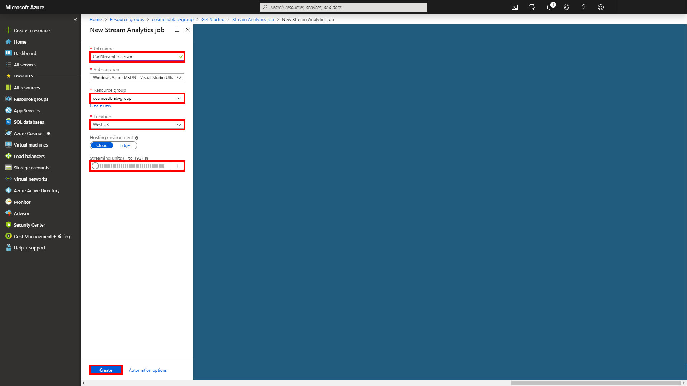

   > Wait for the Stream Analytics Job to be Created and Proceed to the Next Step

1. Return to the **cosmosdblab-group** resource blade and select the stream analytics job you just created

   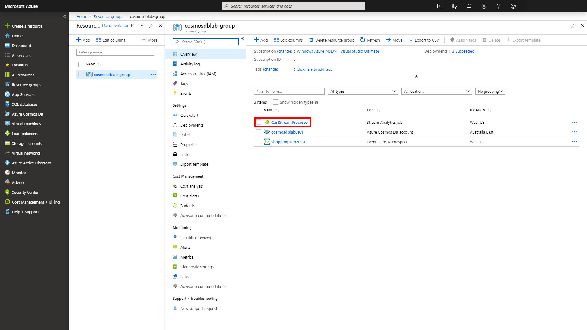

1. Select **Inputs** from the **Overview** screen

   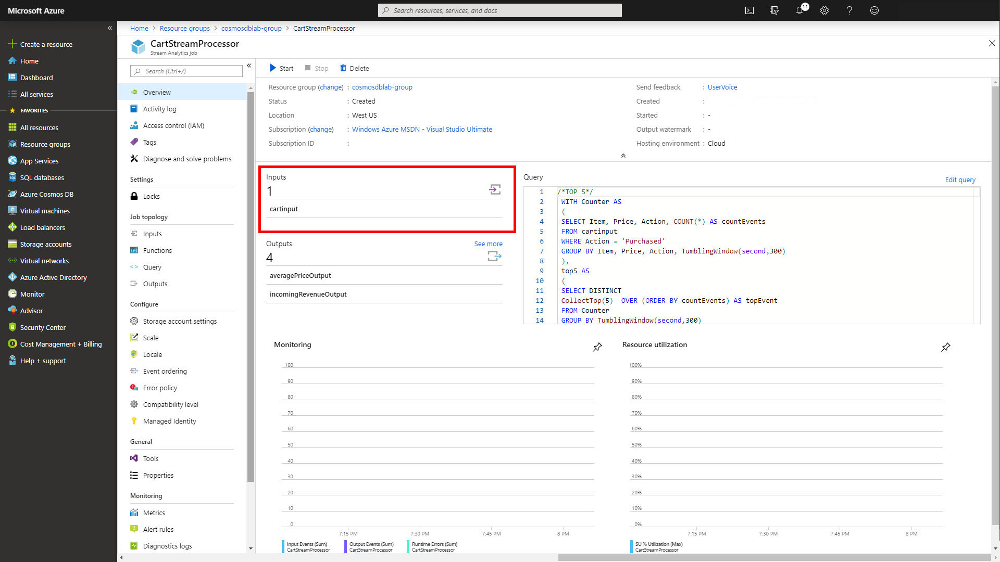

1. Click **Add stream input**

   

1. Select **Event Hub**

1. In the panel that appears, enter the following information

   1. For _Input alias_ enter `cartinput`

   1. Select the option _Select Event Hub from your subscriptions_

   1. Leave _Subscription_ set to the default value

   1. Choose the _Event Hub namespace_ you just created from the dropdown (i.e. **shoppingHub2020**)

   1. Leave the _Event Hub policy name_ set to the default **RootManageSharedAccessKey**

   1. Leave _Event Hub consumer group_ blank

   1. Ensure _Event serialization format_ is set to **JSON**

   1. Ensure _Encoding_ is set to **UTF-8**

   1. Ensure _Event compression type_ is set to **None**

   1. Click **Save**

   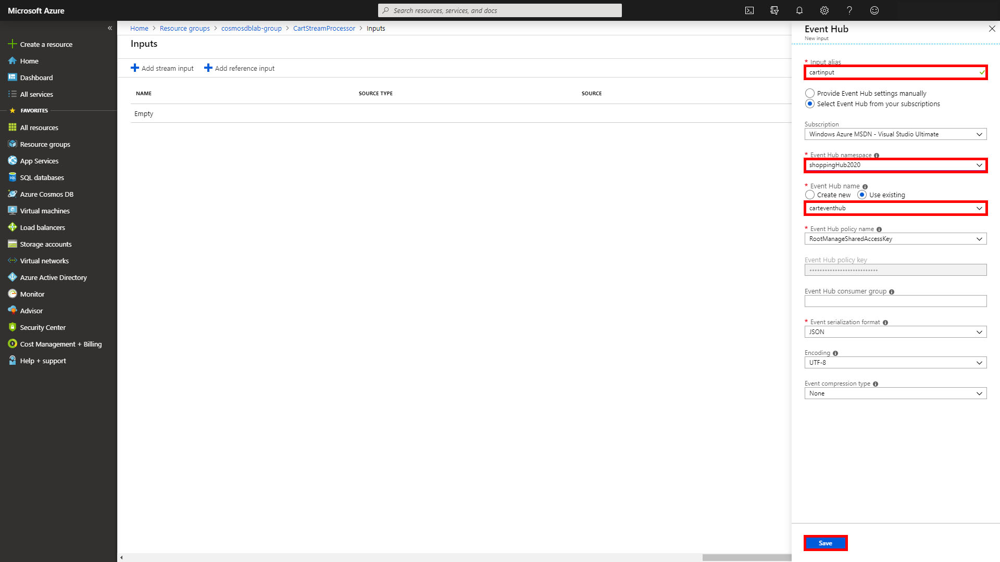

   > Wait for the Input setup to be completed then proceed to the next step

1. Return to the **CartStreamProcessor** Overview Screen and select **Outputs**

   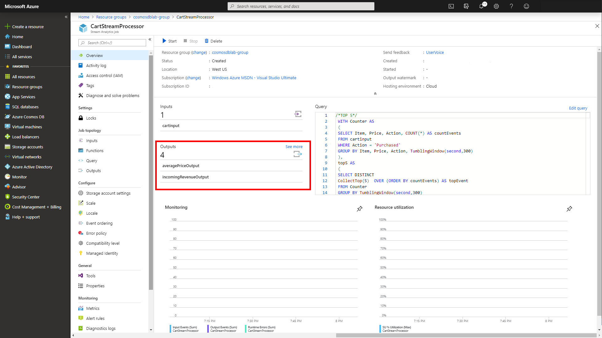

1. At the top of the **Outputs** page, select **Add** and choose **Power BI**

   

1. In the window that appears enter the following data

   1. Set _Output alias_ to `averagePriceOutput`

   1. Set _Dataset name_ to `averagePrice`

   1. Set _Table name_ to `averagePrice`

   1. Click the **Authorize** button and follow the login promps to authorize this output in your Power BI account

   1. Click **Save**

   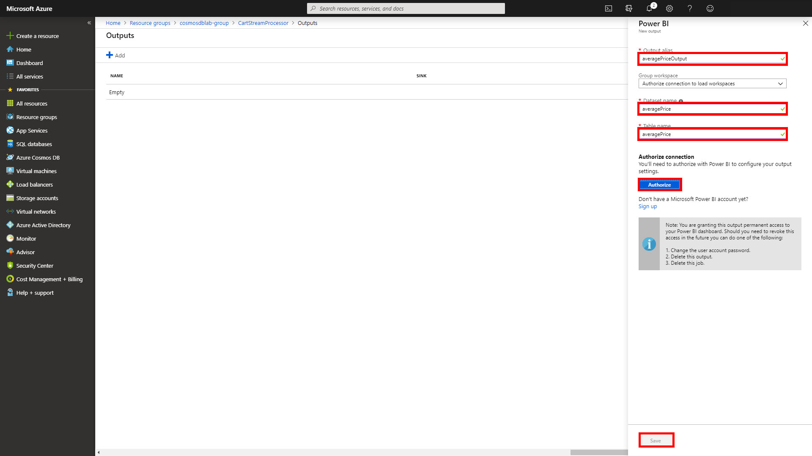

1. Repeat the previous step to add a second output

   1. Set _Output alias_ to `incomingRevenueOutput`

   1. Set _Dataset name_ to `incomingRevenue`

   1. Set _Table name_ to `incomingRevenue`

   1. Authorize the output

   1. Click **Save**

1. Repeat the previous step to add a third output

   1. Set _Output alias_ to `top5Output`

   1. Set _Dataset name_ to `top5`

   1. Set _Table name_ to `top5`

   1. Authorize the output

   1. Click **Save**

1. Repeat the previous step add a fourth (and final) output

   1. Set _Output alias_ to `uniqueVisitorCountOutput`

   1. Set _Dataset name_ to `uniqueVisitorCount`

   1. Set _Table name_ to `uniqueVisitorCount`

   1. Authorize the output

   1. Click **Save**

1. Once you've completed these steps, the **Outputs** blade should look like this:

   

1. Return to the **CartStreamProcess** Overview page and click the **Edit query** button on the right of the screen.

1. Paste the following into the query window and choose **Save**

   ```sql
   /*TOP 5*/
   WITH Counter AS
   (
   SELECT Item, Price, Action, COUNT(*) AS countEvents
   FROM cartinput
   WHERE Action = 'Purchased'
   GROUP BY Item, Price, Action, TumblingWindow(second,300)
   ),
   top5 AS
   (
   SELECT DISTINCT
   CollectTop(5)  OVER (ORDER BY countEvents) AS topEvent
   FROM Counter
   GROUP BY TumblingWindow(second,300)
   ),
   arrayselect AS
   (
   SELECT arrayElement.ArrayValue
   FROM top5
   CROSS APPLY GetArrayElements(top5.topevent) AS arrayElement
   )
   SELECT arrayvalue.value.item, arrayvalue.value.price, arrayvalue.value.countEvents
   INTO top5Output
   FROM arrayselect

   /*REVENUE*/
   SELECT System.TimeStamp AS Time, SUM(Price)
   INTO incomingRevenueOutput
   FROM cartinput
   WHERE Action = 'Purchased'
   GROUP BY TumblingWindow(minute, 5)

   /*UNIQUE VISITORS*/
   SELECT System.TimeStamp AS Time, COUNT(DISTINCT CartID) as uniqueVisitors
   INTO uniqueVisitorCountOutput
   FROM cartinput
   GROUP BY TumblingWindow(second, 30)

   /*AVERAGE PRICE*/
   SELECT System.TimeStamp AS Time, Action, AVG(Price)
   INTO averagePriceOutput
   FROM cartinput
   GROUP BY Action, TumblingWindow(second,30)
   ```

   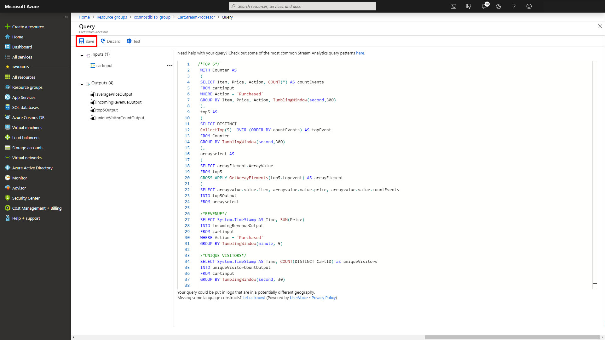

### Create an Azure Function to write data to the Event Hub

_With all of the configuration out of the way, you'll see how simple it is to write an Azure Function to write change data to your new Event Hub in real time_

1. Open a terminal window and navigate to the the **ChangeFeedFunctions** folder

1. Create a new function by entering and executing the following command:

   ```sh
   func new
   ```

   1. When prompted select **CosmosDBTrigger** as the _template_

   1. When prompted enter `AnalyticsFunction` as the _name_

1. Add the [Microsoft Azure Event Hubs](https://www.nuget.org/packages/Microsoft.Azure.EventHubs/) NuGet Package by entering and executing the following:

   ```sh
   dotnet add package Microsoft.Azure.EventHubs --version 3.0.0
   ```

1. Switch to Visual Studio Code and open the new **AnalyticsFunction.cs** file in the editor by double clicking it

1. Add the following usings to the top of the **AnalyticsFunction.cs** file

   ```csharp
   using Microsoft.Azure.EventHubs;
   using System.Threading.Tasks;
   using System.Text;
   ```

1. Modify the signature of the **Run** function by setting **databaseName** to `StoreDatabase`, **collectionName** to `CartContainer`, **ConnectionStringSetting** to `DBConnection` and **LeaseCollectionName** to `analyticsLeases`.

1. In between the **ConnectionStringSetting** and **LeaseColelctionName** add the following line:

   ```csharp
   CreateLeaseCollectionIfNotExists = true,
   ```

1. Modify the **Run** function to be async. The code file should now look like this:

   ```csharp
   using System.Collections.Generic;
   using Microsoft.Azure.Documents;
   using Microsoft.Azure.WebJobs;
   using Microsoft.Azure.WebJobs.Host;
   using Microsoft.Extensions.Logging;
   using Microsoft.Azure.EventHubs;
   using System.Threading.Tasks;
   using System.Text;

   namespace ChangeFeedFunctions
   {
       public static class AnalyticsFunction
       {
           [FunctionName("AnalyticsFunction")]
           public static async Task Run([CosmosDBTrigger(
               databaseName: "StoreDatabase",
               collectionName: "CartContainer",
               ConnectionStringSetting = "DBConnection",
               CreateLeaseCollectionIfNotExists = true,
               LeaseCollectionName = "analyticsLeases")]IReadOnlyList<Document> input, ILogger log)
           {
               if (input != null && input.Count > 0)
               {
                   log.LogInformation("Documents modified " + input.Count);
                   log.LogInformation("First document Id " + input[0].Id);
               }
           }
       }
   }
   ```

1. At the top of the class, add the following configuration parameters:

   ```csharp
   private static readonly string _eventHubConnection = "<event-hub-connection>";
   private static readonly string _eventHubName = "carteventhub";
   ```

1. Replace the placeholder in **\_eventHubConnection** with the value of the Event Hubs **Connection string-primary key** you collected earlier.

1. Start by creating an **EventHubClient** by replacing the two logging lines with the following code:

   ```csharp
   var sbEventHubConnection = new EventHubsConnectionStringBuilder(_eventHubConnection){
       EntityPath = _eventHubName
   };

   var eventHubClient = EventHubClient.CreateFromConnectionString(sbEventHubConnection.ToString());

   //todo: Next steps here
   ```

1. For each document that changed we want to write the data out to the Event Hub. Fortuntaely, we configured our Event Hub to expect JSON data so there's very little processing to do here. Add the following code snippet.

   ```csharp
   var tasks = new List<Task>();

   foreach (var doc in input)
   {
       var json = doc.ToString();

       var eventData = new EventData(Encoding.UTF8.GetBytes(json));

       log.LogInformation("Writing to Event Hub");
       tasks.Add(eventHubClient.SendAsync(eventData));
   }

   await Task.WhenAll(tasks);
   ```

1. The final version of the **AnalyticsFunction** looks like this:

   ```csharp
   using System.Collections.Generic;
   using Microsoft.Azure.Documents;
   using Microsoft.Azure.WebJobs;
   using Microsoft.Azure.WebJobs.Host;
   using Microsoft.Extensions.Logging;
   using Microsoft.Azure.EventHubs;
   using System.Threading.Tasks;
   using System.Text;

   namespace ChangeFeedFunctions
   {
       public static class AnalyticsFunction
       {
           private static readonly string _eventHubConnection = "<your-connection-string>";
           private static readonly string _eventHubName = "carteventhub";

           [FunctionName("AnalyticsFunction")]
           public static async Task Run([CosmosDBTrigger(
               databaseName: "StoreDatabase",
               collectionName: "CartContainer",
               ConnectionStringSetting = "DBConnection",
               CreateLeaseCollectionIfNotExists = true,
               LeaseCollectionName = "analyticsLeases")]IReadOnlyList<Document> input, ILogger log)
           {
               if (input != null && input.Count > 0)
               {
                   var sbEventHubConnection = new EventHubsConnectionStringBuilder(_eventHubConnection)
                   {
                       EntityPath = _eventHubName
                   };

                   var eventHubClient = EventHubClient.CreateFromConnectionString(sbEventHubConnection.ToString());

                   var tasks = new List<Task>();

                   foreach (var doc in input)
                   {
                       var json = doc.ToString();

                       var eventData = new EventData(Encoding.UTF8.GetBytes(json));

                       log.LogInformation("Writing to Event Hub");
                       tasks.Add(eventHubClient.SendAsync(eventData));
                   }

                   await Task.WhenAll(tasks);
               }
           }
       }
   }
   ```

### Creating a Power BI Dashboard to Test the AnalyticsFunction

1. Once again, open two terminal windows.

1. In the **first** terminal window navigate to the **DataGenerator** folder

1. In the **second** terminal window navigate to the **ChangeFeedFunctions** folder

1. In the **second** terminal window, start the Azure Functions by entering and executing the following line:

   ```sh
   func host start
   ```

1. In the **first** terminal window start the data generation process by entering and executing the following line:

   ```sh
   dotnet run
   ```

1. Confirm the data generator is running and that the Azure Functions are firing before proceeding to the next steps

1. Return to the **CartStreamProcessor** overview screen and click the **Start** button at the top to start the processor. When prompted choose to start the output **now**. Starting the processor may take several minutes.

   

   > Wait for the processor to start before continuing

1. Open a web browser and navigate to the **Power BI** website.

1. Sign in, and choose **My Workspace** from the left hand section

   

1. In the top right of the screen select **Create** and choose **Dashboard** give the dashbaord any _Name_

1. In the **Dashboard** screen, select **Add tile** from the top

   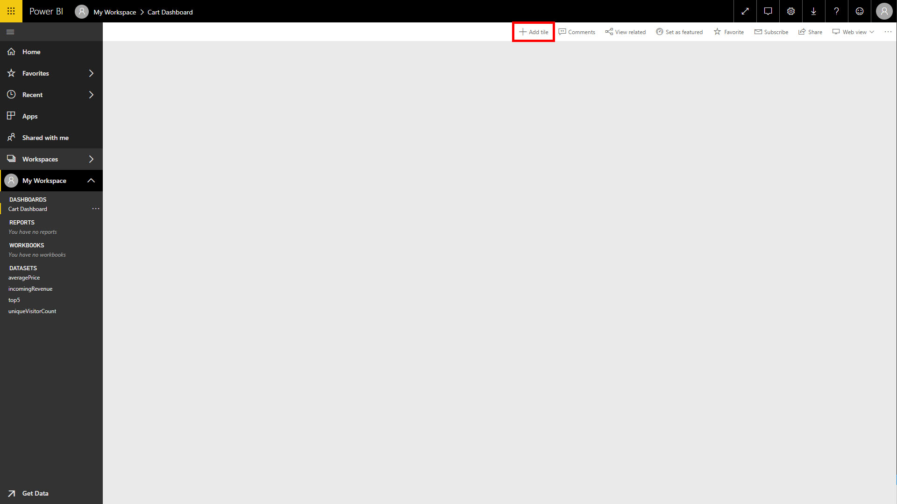

1. Choose **Custom Streaming Data** and hit **Next**

   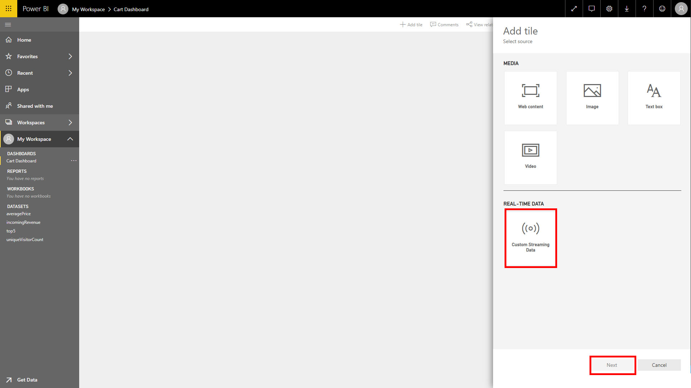

1. Choose **averagePrice** from the **Add custom sreaming data tile** window

   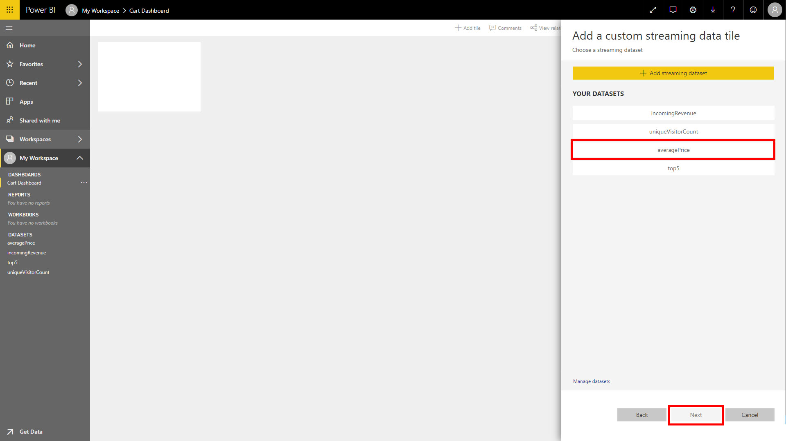

1. From _Visualization Type_ select **Clustered bar char**

   1. Under _Axis_ click **Add Value** and select **Action**

   1. Under _Value_ click **Add value** and select **AVG**

   1. Click **Next**

   

   1. Give it a name like `Average Price` and click **Apply**

1. Follow these same steps to add tiles for the remaining three inputs

   1. For **incomingRevenue** select a **Line chart** with **Axis** set to `Time` and **Values** set to `Sum`. Set **Time window to display** to at least 30 minutes.

   1. For **uniqueVisitors** select a **Card** with **Fields** set to `uniqueVisitors`

   1. For **top5** select a **Clustered column chart** with **Axis** set to `Item` and **Value** set to `countEvents`

1. When complete, you'll have a dashboard that looks like the image below, updating in real time!

   
